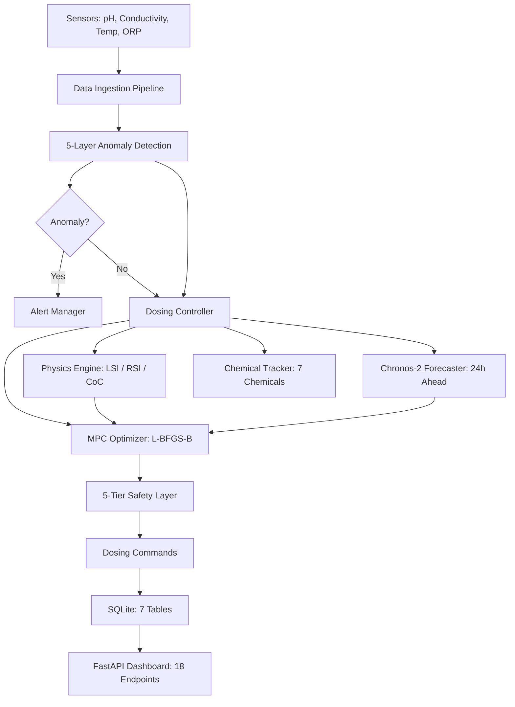

# TGF -- Autonomous Cooling Tower Water Treatment

Physics-informed MPC + foundation-model anomaly detection for Indian industrial cooling towers. Replaces manual chemical dosing with a 5-minute autonomous control loop.


## The Problem

India's cooling towers lose 2--5% of operational capacity annually to scaling, corrosion, and biofouling. Manual operators test water 2--3 times per day and react to problems *after* they appear, wasting 15--25% of chemicals through over-dosing. A single unplanned shutdown from scaling or corrosion costs $50K--$200K. The industry charges $50K--$200K/year for automation -- TGF targets $20K/year total cost.

## What TGF Does

TGF reads pH, conductivity, temperature, and ORP every 5 minutes, detects anomalies using a 385M-parameter foundation model, forecasts parameter trajectories 24 hours ahead, and optimizes chemical doses using Model Predictive Control -- all with a 5-tier safety layer that guarantees hard constraints.



## Results

Validated on 5,614 sensor readings from a real DCM (Dalmia Cement) cooling tower, 2013--2025:

| Metric | Value |
|--------|-------|
| Cycles in optimal LSI range | **86.2%** |
| Critical risk cycles | **0%** |
| Preemptive dosing rate | **78%** |
| Chemical cost savings vs manual | **16.7%** |
| Safety violations | **0 / 5,614 cycles** |

## Technical Architecture

### MPC Optimizer

L-BFGS-B with 24-step receding horizon (2 hours at 5-minute intervals). 10-component cost function balancing chemical cost, scaling/corrosion/biofouling risk, Chronos-2 forecast penalties, CPCB discharge compliance, and rate smoothing. Differential evolution fallback for non-convex cases. Only the first step is executed, then re-optimized next cycle.

### MOMENT Anomaly Detection

385M-parameter pre-trained time-series foundation model ([ICML 2024](https://arxiv.org/abs/2402.03885)). Reconstruction-based anomaly detection with RevIN normalization and adaptive POT (Peaks Over Threshold) thresholding. Validated against two alternatives:

| Model | Type | Params | Val Loss | Status |
|-------|------|--------|----------|--------|
| **MOMENT** | Foundation (pre-trained) | 385M | 0.0069 | Selected |
| TransNAS-TSAD | NAS + Transformer | ~2M | 0.0145 | Evaluated |
| VTT | Variable Temporal Transformer | ~500K | 0.0203 | Evaluated |

Detection uses 5 layers: range check, z-score, rate-of-change, cross-parameter correlation, and MOMENT reconstruction error.

### Chronos-2 Forecaster

Amazon's zero-shot probabilistic forecasting model. Returns p10/p50/p90 quantiles for a 24-hour horizon. Enables preemptive dosing -- treating problems before they manifest. When Chronos-2 predicts pH will exceed 8.5 in 6 hours, the MPC begins scale inhibitor dosing immediately at a lower rate, rather than reacting later at a higher rate.

### Cascade Detector

Granger-causality state machine detecting failure chains: corrosion &rarr; particles &rarr; biofilm &rarr; scale. Tests causal links between iron&rarr;turbidity, turbidity&rarr;free chlorine, and free chlorine&rarr;hardness. Left-to-right state transitions only (no backtracking).

### Physics Engine

Langelier Saturation Index (LSI) and Ryznar Stability Index (RSI) from classical water chemistry equations. Cycles of Concentration (CoC) estimated from conductivity. Virtual sensor provides physics-informed ML hybrid estimates of hardness and alkalinity when lab data is unavailable.

### Safety Layer

5-tier defense-in-depth:

1. **Sensor fault detection** -- impossible values trigger PID fallback
2. **Hard limits** -- absolute max/min for every chemical dose
3. **Rate limiting** -- max 20% change per 5-minute cycle
4. **PID backup** -- classical controllers with anti-windup saturation
5. **Emergency stop** -- halt all dosing on multiple sensor failures

### Chemical Tracker

Mass balance for 7 Aquatech chemicals with Arrhenius temperature-dependent decay rates, Bayesian confidence scoring, and calibration from ORP sensor feedback and weekly lab tests.

## Why MPC, Not Reinforcement Learning

1. **Works with 5K samples** -- RL needs millions of interactions
2. **Hard safety constraints** -- mathematically guaranteed, not soft penalties
3. **Explainable** -- "dosing because LSI forecast at +1.8 in 6 hours"
4. **Production-ready in weeks** -- RL needs months of simulation environment development
5. **Zero risk of constraint violation** during exploration

With 5,614 real sensor readings and hard safety requirements for industrial deployment, MPC was the principled engineering choice.

## Quick Start

```bash
# Install dependencies
pip install -r requirements.txt

# Run simulation (headless, 100 cycles)
python -m tgf_dosing.main --data data/Parameters_5K.csv --cycles 100 --no-api --speed 0

# Run with dashboard (open http://localhost:8000)
python -m tgf_dosing.main --data data/Parameters_5K.csv --cycles 500 --speed 0

# Run with MOMENT anomaly detection
python -m tgf_dosing.main --data data/Parameters_5K.csv --moment-checkpoint checkpoints/moment_model.pkl

# Run tests
pytest tests/ -v
```

## Project Structure

```
tgf_dosing/                      # Production package (~10K LOC)
    config/                      # Tower specs, 7 chemical definitions
    core/                        # Physics engine, MPC, safety layer, cascade detection
    infrastructure/              # Data pipeline, anomaly detection, API, persistence
    models/                      # MOMENT wrapper, online detection
    validation/                  # Walk-forward backtester
tests/                           # 10 test files (pytest)
data/                            # Curated datasets from real Indian cooling towers
research/                        # Model experiments (MOMENT, TransNAS, VTT, Tempura)
docs/                            # Architecture, API reference, hardware guide
scripts/                         # Model download utility
```

## Roadmap

- Edge deployment on Raspberry Pi 4 ($12K hardware per tower)
- ONNX export for MOMENT inference at the edge
- Multi-tower fleet management

## Citations

- **MOMENT**: Goswami et al., "MOMENT: A Family of Open Time-series Foundation Models", ICML 2024
- **Chronos**: Ansari et al., "Chronos: Learning the Language of Time Series", Amazon, 2024
- **LSI**: Langelier, W.F., "The Analytical Control of Anti-Corrosion Water Treatment", 1936
- **RSI**: Ryznar, J.W., "A New Index for Determining Amount of Calcium Carbonate Scale Formed by a Water", 1944

## License

Apache 2.0 -- see [LICENSE](LICENSE).
