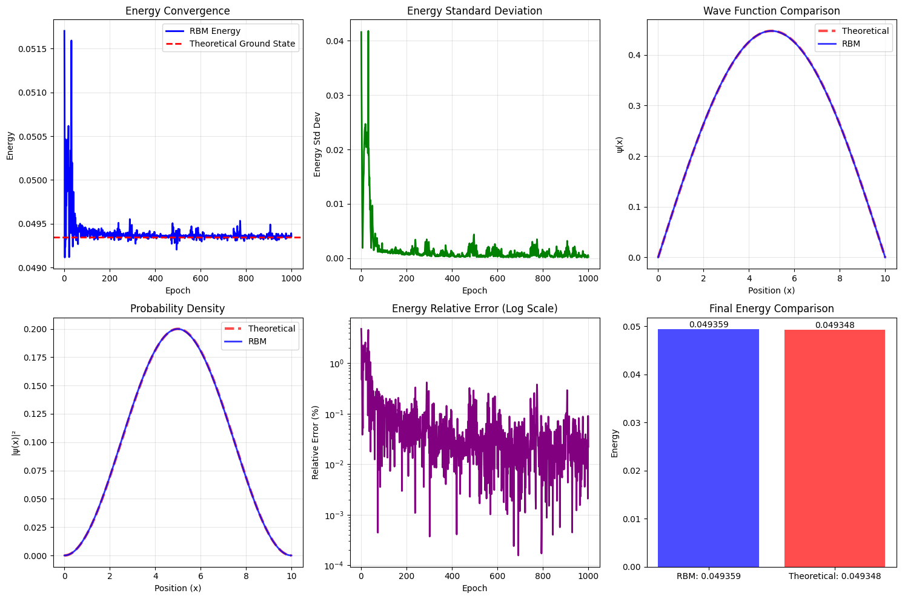

Using device: cpu 
Particle in a 1D Box - RBM Variational Monte Carlo 
============================================================

Initializing RBM with 50 hidden units... 
Box length: 10.0 
Training for 1000 epochs with 2000 samples per epoch 

Starting variational optimization... 
Epoch 50/1000, Energy: 0.049567, Std: 0.009684 
Epoch 100/1000, Energy: 0.049412, Std: 0.001468 
Epoch 150/1000, Energy: 0.049389, Std: 0.000871 
Epoch 200/1000, Energy: 0.049369, Std: 0.001120 
Epoch 250/1000, Energy: 0.049367, Std: 0.001040 
Epoch 300/1000, Energy: 0.049356, Std: 0.001373 
Epoch 350/1000, Energy: 0.049358, Std: 0.000418 
Epoch 400/1000, Energy: 0.049377, Std: 0.001218 
Epoch 450/1000, Energy: 0.049365, Std: 0.000602 
Epoch 500/1000, Energy: 0.049339, Std: 0.000423 
Epoch 550/1000, Energy: 0.049379, Std: 0.000765 
Epoch 600/1000, Energy: 0.049344, Std: 0.000275 
Epoch 650/1000, Energy: 0.049352, Std: 0.000168 
Epoch 700/1000, Energy: 0.049347, Std: 0.000308 
Epoch 750/1000, Energy: 0.049393, Std: 0.001624 
Epoch 800/1000, Energy: 0.049359, Std: 0.000175 
Epoch 850/1000, Energy: 0.049357, Std: 0.000207 
Epoch 900/1000, Energy: 0.049388, Std: 0.001091 
Epoch 950/1000, Energy: 0.049363, Std: 0.000519 
Epoch 1000/1000, Energy: 0.049359, Std: 0.000231 

Generating plots...

FINAL RESULTS
============================================================
Box Length (L): 10.0
Theoretical Ground State Energy: 0.049348
RBM Estimated Energy: 0.049359
Relative Error: 0.0222%
Energy Standard Deviation: 0.000231
Wavefunction Overlap: 0.999998
============================================================

EXCITED STATE ANALYSIS
============================================================
Overlap with theoretical n=1 state: 0.999998  
Theoretical energy for n=1: 0.049348 
Overlap with theoretical n=2 state: 0.001717 
Theoretical energy for n=2: 0.197392 
Overlap with theoretical n=3 state: 0.000313 
Theoretical energy for n=3: 0.444132 